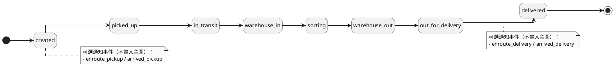
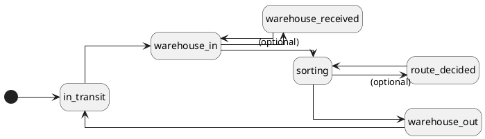
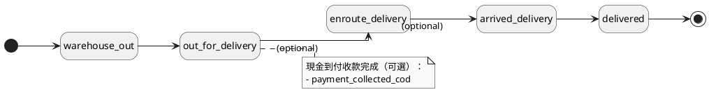
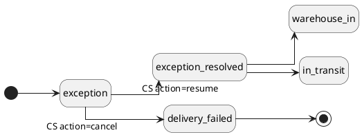

# Event Model & Flows（事件模型與資料流）

本文件屬於 `docs/architecture/` 概念層：描述「事件」在系統中的角色（事實來源）、以及核心資料流如何以事件推動/推導；不承載細部規則或 API schema。

> 規則/流程權威：`docs/modules/README.md`；接口參考：`docs/reference/api/README.md`

## 1) Event Model（事件模型）

### 1.1 什麼是事件（Event）

在本專案中，事件指「某個時間點，包裹在某個 location 發生了某個狀態/動作」；事件會被保存為事實來源（source of truth）。

- 事件表：`package_events`
- 常見欄位概念：
  - `delivery_status`：事件狀態（例如 created / in_transit / arrived_* / delivered / exception…）
  - `events_at`：事件時間
  - `location`：發生地點（節點 ID 或 `TRUCK_*`）

> 名詞與 location 前綴：`docs/architecture/glossary.md`

### 1.2 事實來源 vs 快取

- **事實來源**：`package_events`
- **快取/摘要**：`packages.status`（顧客可見 stage 的快取欄位）

這樣的分工讓：
- UI 追蹤可以用事件重播/推導（更可解釋）
- 列表查詢可以用快取欄位加速

對照文件：
- 追蹤推導規則（權威）：`docs/modules/tracking.md`

### 1.3 貨態事件狀態機（`package_events.delivery_status`）

本節是「事件模型」：以 `delivery_status` 展示整體貨態事件流程。為了可讀性，拆成多張圖：主流程、轉運循環、末端配送、異常分支。

> 事件狀態的列表與對應 stage（快取）以 `docs/reference/api/03-packages.md` 的 Event 表為準；追蹤 UI 的推導/渲染規則以 `docs/modules/tracking.md` 為準。

#### 1) 主流程（Happy Path）

#### 2) 轉運循環（Transfer Cycle）

> 多段轉運會重複出現；此圖只描述站內/轉運的事件循環。

#### 3) 末端配送（Last Mile）

#### 4) 異常分支（Exception）

> 異常可從任意流程階段發生（ANY → exception），此圖只描述異常後的分支：客服結案恢復/取消。

## 2) Core Flows（核心資料流）

### 2.1 建立寄件 → 寫入初始事件 → 產生任務

1. 客戶 `POST /api/packages` 建立包裹主檔。
2. 後端寫入對應 `package_events`（建立/排程等事件）作為事實來源。
3. 後端建立初始 `delivery_tasks`（形成「下一步要做什麼」的可執行工作段）。

對照文件：
- 規則：`docs/modules/shipping.md`
- 接口：`docs/reference/api/03-packages.md`

### 2.2 任務狀態改變 → 事件推進 → 追蹤 stage 推導

1. 司機/倉儲執行任務，更新 `delivery_tasks`（任務狀態機）。
2. 後端同步寫入 `package_events`（例如到達、在途、卸貨等），讓追蹤可被推導。
3. 前端追蹤 UI 用事件推導顧客可見 stage/節點到達/線段在途等顯示。

對照文件：
- 規則：`docs/modules/operations.md`、`docs/modules/tracking.md`
- 接口：`docs/reference/api/08-operations-tasks.md`、`docs/reference/api/03-packages.md`

### 2.3 異常成立 → 中止正常流轉 → 結案恢復

1. 建立異常後進入 `package_exceptions` 異常池。
2. 系統會取消/封鎖 normal flow 的 active tasks，避免任務繼續執行。
3. 客服結案後解除封鎖，恢復後續任務與事件推進。

對照文件：
- 規則（權威）：`docs/modules/exceptions.md`
- 接口：`docs/reference/api/07-exceptions.md`

## 3) Design Notes（設計提醒）

- **事件語意一致性**：事件文字/狀態應以 `docs/modules/*` 規則層為準，避免在 API doc 或 UI doc 重寫同一條規則。
- **location 一致性**：地面節點用 `END_*`/`REG_*`/`HUB_*`；在途用 `TRUCK_*`（避免 UI 無法推導線段）。
