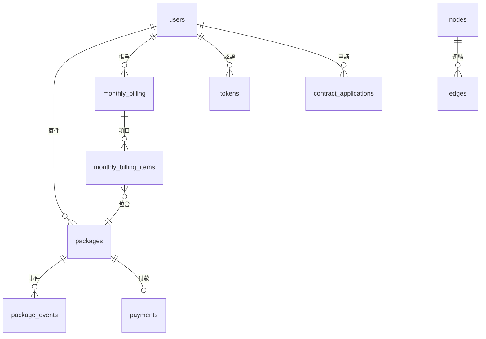

# 資料庫 Schema 說明文件

本文件描述物流追蹤系統後端資料庫的最終表結構（依 `backend/migrations` 套用後的結果），以及各欄位的用途。

---

## 目錄

- [1. 總覽](#1-總覽)
- [2. 表格定義](#2-表格定義)
- [3. ER 圖](#3-er-圖)
- [4. 索引說明](#4-索引說明)
- [5. 版本歷史](#5-版本歷史)

---

## 1. 總覽

| 表格名稱 | 說明 | Migration 檔案 |
|----------|------|----------------|
| `users` | 使用者帳號（客戶/員工） | `0000_users.sql` |
| `packages` | 包裹/寄件主檔 | `0001_packages.sql`, `0008_packages_add_columns.sql` |
| `package_events` | 包裹追蹤事件 | `0002_package_events.sql` |
| `payments` | 單次付款紀錄 | `0003_payments.sql` |
| `monthly_billing` | 月結帳單主檔 | `0004_monthly_billing.sql`, `0012_monthly_billing_add_columns.sql` |
| `monthly_billing_items` | 月結帳單項目 | `0005_monthly_billing_items.sql` |
| `nodes` | 虛擬地圖節點 | `0006_virtual_map_schema.sql`, `0007_virtual_map_seed.sql` |
| `edges` | 虛擬地圖邊/道路 | `0006_virtual_map_schema.sql`, `0007_virtual_map_seed.sql` |
| `contract_applications` | 合約客戶申請/審核 | `0008_contract_applications.sql`, `0011_contract_applications_add_columns.sql` |
| `tokens` | 認證 Token | `0010_tokens.sql` |
| `system_errors` | 系統錯誤紀錄 | `0013_system_errors.sql` |

**虛擬地圖 migrations 說明**

- `0006_virtual_map_schema.sql`：建立 `nodes`、`edges` 兩張表與索引。
- `0007_virtual_map_seed.sql`：由地圖產生器輸出的 seed/reseed 資料，會先清空 `nodes`、`edges` 再重新插入地圖。

---

## 2. 表格定義

### 2.1 `users` - 使用者表

記錄所有使用者帳號（客戶/員工），以及角色與帳單偏好。

```sql
CREATE TABLE users (
  id TEXT PRIMARY KEY,
  user_name TEXT NOT NULL,
  phone_number TEXT,
  address TEXT,
  email TEXT UNIQUE NOT NULL,
  password_hash TEXT NOT NULL,
  user_type TEXT NOT NULL CHECK (user_type IN ('customer', 'employee')),
  user_class TEXT NOT NULL,
  billing_preference TEXT,
  created_at TEXT DEFAULT (strftime('%Y-%m-%dT%H:%M:%SZ', 'now'))
);
```

| 欄位 | 類型 | 說明 |
|------|------|------|
| `id` | TEXT | UUID 主鍵 |
| `user_name` | TEXT | 使用者名稱 |
| `phone_number` | TEXT | 電話號碼（可用於登入） |
| `address` | TEXT | 地址/座標（格式可為 `x,y`） |
| `email` | TEXT | Email（唯一，用於登入） |
| `password_hash` | TEXT | 密碼 SHA-256 雜湊 |
| `user_type` | TEXT | 使用者類型：`customer` 或 `employee` |
| `user_class` | TEXT | 使用者角色/分類（見下表） |
| `billing_preference` | TEXT | 付款/帳單偏好：`cash`, `credit_card`, `bank_transfer`, `monthly`, `third_party_payment` |
| `created_at` | TEXT | 建立時間（ISO 8601） |

**`user_class` 說明**

| user_class | 適用 user_type | 說明 |
|-----------|---------------|------|
| `non_contract_customer` | customer | 非合約客戶 |
| `contract_customer` | customer | 合約客戶（月結） |
| `driver` | employee | 司機 |
| `warehouse_staff` | employee | 倉儲人員 |
| `customer_service` | employee | 客服 |
| `admin` | employee | 系統管理員 |

---

### 2.2 `packages` - 包裹表

包裹/寄件的主資料，包含寄件/收件資訊、費用、狀態與追蹤號。  
欄位 `sender_phone`、`receiver_phone`、`status` 等由 `0008_packages_add_columns.sql` 補上。

```sql
CREATE TABLE packages (
  id TEXT PRIMARY KEY,
  customer_id TEXT,
  sender_name TEXT,
  sender_phone TEXT,
  sender_address TEXT,
  receiver_name TEXT,
  receiver_phone TEXT,
  receiver_address TEXT,
  weight INTEGER,
  size TEXT,
  delivery_time TEXT,
  payment_type TEXT,
  declared_value INTEGER,
  final_billing_date TEXT,
  special_handling TEXT,
  tracking_number TEXT,
  contents_description TEXT,
  route_path TEXT,
  description_json TEXT,
  status TEXT DEFAULT 'created',
  estimated_delivery TEXT,
  created_at TEXT DEFAULT (strftime('%Y-%m-%dT%H:%M:%SZ', 'now'))
);
```

| 欄位 | 類型 | 說明 |
|------|------|------|
| `id` | TEXT | UUID 主鍵 |
| `customer_id` | TEXT | 客戶 `users.id`（邏輯關聯） |
| `sender_name` | TEXT | 寄件人姓名 |
| `sender_phone` | TEXT | 寄件人電話 |
| `sender_address` | TEXT | 寄件人地址 |
| `receiver_name` | TEXT | 收件人姓名 |
| `receiver_phone` | TEXT | 收件人電話 |
| `receiver_address` | TEXT | 收件人地址 |
| `weight` | INTEGER | 重量（kg） |
| `size` | TEXT | 尺寸（例如 `30x20x10` 或 `medium`） |
| `delivery_time` | TEXT | 配送時效：`overnight`, `two_day`, `standard`, `economy` |
| `payment_type` | TEXT | 付款類型（預付/到付） |
| `declared_value` | INTEGER | 申報價值 |
| `final_billing_date` | TEXT | 最終計費日 |
| `special_handling` | TEXT | 特殊處理 JSON（例：`["fragile_items","dangerous_materials"]`） |
| `tracking_number` | TEXT | 追蹤編號 |
| `contents_description` | TEXT | 內容物描述 |
| `route_path` | TEXT | 路徑/節點 JSON |
| `description_json` | TEXT | 其他描述 JSON |
| `status` | TEXT | 包裹狀態（預設 `created`） |
| `estimated_delivery` | TEXT | 預計送達時間 |
| `created_at` | TEXT | 建立時間 |

---

### 2.3 `package_events` - 包裹事件表

記錄包裹追蹤過程中的事件與狀態變化。

```sql
CREATE TABLE package_events (
  id TEXT PRIMARY KEY,
  package_id TEXT,
  delivery_status TEXT,
  delivery_details TEXT,
  events_at TEXT,
  location TEXT
);
```

| 欄位 | 類型 | 說明 |
|------|------|------|
| `id` | TEXT | UUID 主鍵 |
| `package_id` | TEXT | 包裹 ID（邏輯關聯 `packages.id`） |
| `delivery_status` | TEXT | 事件狀態（見下表） |
| `delivery_details` | TEXT | 事件細節 |
| `events_at` | TEXT | 事件時間（ISO 8601） |
| `location` | TEXT | 位置（節點/地址） |

**`delivery_status` 說明**

| status | 說明 |
|--------|------|
| `created` | 包裹已建立 |
| `picked_up` | 已取件 |
| `in_transit` | 運送中 |
| `sorting` | 分揀/轉運中 |
| `warehouse_in` | 入庫 |
| `warehouse_out` | 出庫 |
| `out_for_delivery` | 派送中 |
| `delivered` | 已送達/簽收 |
| `exception` | 異常（遺失/延誤/拒收等） |

---

### 2.4 `payments` - 付款表

記錄每次寄件的付款計算與付款時間。

```sql
CREATE TABLE payments (
  id TEXT PRIMARY KEY,
  total_amount INTEGER,
  service_fee INTEGER,
  distance_fee INTEGER,
  weight_volume_fee INTEGER,
  special_fee INTEGER,
  calculated_at TEXT,
  paid_at TEXT,
  package_id TEXT REFERENCES packages(id)
);
```

| 欄位 | 類型 | 說明 |
|------|------|------|
| `id` | TEXT | UUID 主鍵 |
| `total_amount` | INTEGER | 總金額 |
| `service_fee` | INTEGER | 服務費 |
| `distance_fee` | INTEGER | 距離費 |
| `weight_volume_fee` | INTEGER | 重量/體積費 |
| `special_fee` | INTEGER | 特殊處理附加費 |
| `calculated_at` | TEXT | 計算時間 |
| `paid_at` | TEXT | 付款時間 |
| `package_id` | TEXT | 對應包裹 ID（FK） |

---

### 2.5 `monthly_billing` - 月結帳單表

合約客戶每期月結帳單主檔；`status/total_amount/...` 欄位由 `0012_monthly_billing_add_columns.sql` 補上。

```sql
CREATE TABLE monthly_billing (
  id TEXT PRIMARY KEY,
  customer_id TEXT,
  cycle_start TEXT,
  cycle_end TEXT,
  next_generated_at TEXT,
  status TEXT DEFAULT 'pending' CHECK (status IN ('pending', 'paid', 'overdue')),
  total_amount INTEGER DEFAULT 0,
  due_date TEXT,
  paid_at TEXT,
  created_at TEXT DEFAULT (strftime('%Y-%m-%dT%H:%M:%SZ', 'now'))
);
```

| 欄位 | 類型 | 說明 |
|------|------|------|
| `id` | TEXT | UUID 主鍵 |
| `customer_id` | TEXT | 客戶 ID（邏輯關聯 `users.id`） |
| `cycle_start` | TEXT | 計費起始日 |
| `cycle_end` | TEXT | 計費結束日 |
| `next_generated_at` | TEXT | 下次產生帳單時間 |
| `status` | TEXT | 帳單狀態：`pending`, `paid`, `overdue` |
| `total_amount` | INTEGER | 帳單總金額 |
| `due_date` | TEXT | 到期日 |
| `paid_at` | TEXT | 付款時間 |
| `created_at` | TEXT | 建立時間 |

---

### 2.6 `monthly_billing_items` - 月結帳單項目表

帳單中包含的包裹項目關聯表。

```sql
CREATE TABLE monthly_billing_items (
  id TEXT PRIMARY KEY,
  monthly_billing_id TEXT,
  package_id TEXT
);
```

| 欄位 | 類型 | 說明 |
|------|------|------|
| `id` | TEXT | UUID 主鍵 |
| `monthly_billing_id` | TEXT | 帳單 ID（邏輯關聯 `monthly_billing.id`） |
| `package_id` | TEXT | 包裹 ID（邏輯關聯 `packages.id`） |

---

### 2.7 `nodes` - 地圖節點表

虛擬地圖的節點（轉運中心/區域中心/終端站）。

```sql
CREATE TABLE nodes (
  id TEXT PRIMARY KEY,
  name TEXT,
  level INTEGER,
  subtype TEXT,
  x INTEGER,
  y INTEGER
);
```

| 欄位 | 類型 | 說明 |
|------|------|------|
| `id` | TEXT | 節點 ID |
| `name` | TEXT | 節點名稱 |
| `level` | INTEGER | 層級：1=HUB, 2=REG, 3=END |
| `subtype` | TEXT | 終端節點類型（僅 END 使用：`home` 住家、`store` 超商） |
| `x` | INTEGER | X 座標 |
| `y` | INTEGER | Y 座標 |

---

### 2.8 `edges` - 地圖邊表

節點之間的道路連結與成本。

```sql
CREATE TABLE edges (
  id INTEGER PRIMARY KEY AUTOINCREMENT,
  source TEXT,
  target TEXT,
  distance REAL,
  road_multiple INTEGER,
  cost INTEGER,
  FOREIGN KEY(source) REFERENCES nodes(id),
  FOREIGN KEY(target) REFERENCES nodes(id)
);

CREATE INDEX idx_edges_source ON edges(source);
```

| 欄位 | 類型 | 說明 |
|------|------|------|
| `id` | INTEGER | 自增主鍵 |
| `source` | TEXT | 起點節點 ID |
| `target` | TEXT | 終點節點 ID |
| `distance` | REAL | 距離 |
| `road_multiple` | INTEGER | 道路倍率 |
| `cost` | INTEGER | 運輸成本 |

---

### 2.9 `contract_applications` - 合約申請表

客戶申請成為合約客戶的資料與審核結果。  
注意：`customer_id` 在目前 migration 中未加 FK 約束（僅邏輯關聯）；審核欄位由 `0011_contract_applications_add_columns.sql` 補上。

```sql
CREATE TABLE contract_applications (
  id TEXT PRIMARY KEY,
  customer_id TEXT NOT NULL,
  company_name TEXT NOT NULL,
  tax_id TEXT NOT NULL,
  contact_person TEXT NOT NULL,
  contact_phone TEXT NOT NULL,
  billing_address TEXT NOT NULL,
  notes TEXT,
  status TEXT NOT NULL DEFAULT 'pending' CHECK (status IN ('pending', 'approved', 'rejected')),
  reviewed_by TEXT REFERENCES users(id),
  reviewed_at TEXT,
  review_notes TEXT,
  credit_limit INTEGER,
  created_at TEXT DEFAULT (strftime('%Y-%m-%dT%H:%M:%SZ', 'now'))
);
```

| 欄位 | 類型 | 說明 |
|------|------|------|
| `id` | TEXT | UUID 主鍵 |
| `customer_id` | TEXT | 申請人 ID |
| `company_name` | TEXT | 公司名稱 |
| `tax_id` | TEXT | 統一編號 |
| `contact_person` | TEXT | 聯絡人 |
| `contact_phone` | TEXT | 聯絡電話 |
| `billing_address` | TEXT | 發票/帳單地址 |
| `notes` | TEXT | 申請備註 |
| `status` | TEXT | `pending`, `approved`, `rejected` |
| `reviewed_by` | TEXT | 審核者 ID |
| `reviewed_at` | TEXT | 審核時間 |
| `review_notes` | TEXT | 審核備註 |
| `credit_limit` | INTEGER | 信用額度 |
| `created_at` | TEXT | 申請時間 |

---

### 2.10 `tokens` - 認證 Token 表

儲存登入後簽發的 access token。

```sql
CREATE TABLE tokens (
  id TEXT PRIMARY KEY,
  user_id TEXT NOT NULL REFERENCES users(id),
  created_at TEXT DEFAULT (strftime('%Y-%m-%dT%H:%M:%SZ', 'now')),
  expires_at TEXT
);
```

| 欄位 | 類型 | 說明 |
|------|------|------|
| `id` | TEXT | Token UUID |
| `user_id` | TEXT | 使用者 ID（FK `users.id`） |
| `created_at` | TEXT | 建立時間 |
| `expires_at` | TEXT | 過期時間 |

---

### 2.11 `system_errors` - 系統錯誤表

供管理端查詢/追蹤系統錯誤事件。

```sql
CREATE TABLE system_errors (
  id TEXT PRIMARY KEY,
  level TEXT NOT NULL CHECK (level IN ('info', 'warning', 'error', 'critical')),
  code TEXT,
  message TEXT NOT NULL,
  details TEXT,
  occurred_at TEXT DEFAULT (strftime('%Y-%m-%dT%H:%M:%SZ', 'now')),
  resolved INTEGER DEFAULT 0,
  resolved_by TEXT REFERENCES users(id),
  resolved_at TEXT
);
```

| 欄位 | 類型 | 說明 |
|------|------|------|
| `id` | TEXT | UUID 主鍵 |
| `level` | TEXT | 等級：`info`, `warning`, `error`, `critical` |
| `code` | TEXT | 錯誤代碼 |
| `message` | TEXT | 錯誤訊息 |
| `details` | TEXT | 詳細資訊 |
| `occurred_at` | TEXT | 發生時間 |
| `resolved` | INTEGER | 是否已解決（0/1） |
| `resolved_by` | TEXT | 解決者 ID（FK `users.id`） |
| `resolved_at` | TEXT | 解決時間 |

---

## 3. ER 圖



---

## 4. 索引說明

| 表格 | 索引名稱 | 欄位 | 說明 |
|------|----------|------|------|
| `users` | (UNIQUE) | `email` | Email 唯一索引 |
| `edges` | `idx_edges_source` | `source` | 加速路線查詢 |
| `tokens` | `idx_tokens_user_id` | `user_id` | 加速依使用者查 token |
| `contract_applications` | `idx_contract_applications_customer` | `customer_id` | 加速依客戶查申請 |
| `contract_applications` | `idx_contract_applications_status` | `status` | 加速狀態篩選 |
| `system_errors` | `idx_system_errors_level` | `level` | 加速依等級篩選 |
| `system_errors` | `idx_system_errors_resolved` | `resolved` | 加速已解決/未解決篩選 |

---

## 5. 版本歷史

| 版本 | 日期 | 說明 |
|------|------|------|
| 1.0 | 2025-12-11 | 初版：建立核心 Schema（users/packages/events/payments/月結/地圖） |
| 1.1 | 2025-12-11 | 補齊 API contract：新增 packages 補欄位、tokens、合約申請審核欄位、月結帳單狀態欄位、system_errors |
