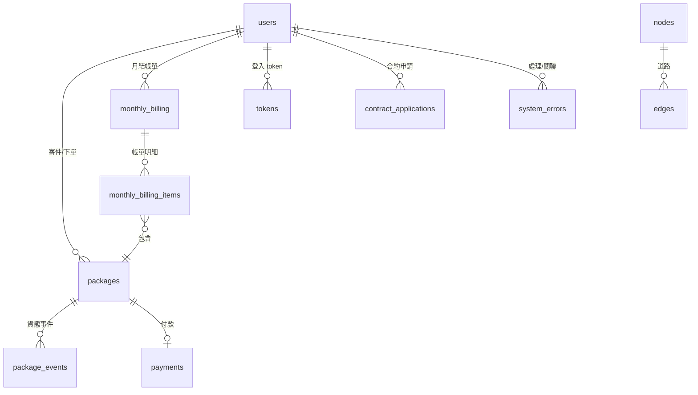

# 資料庫 Schema 說明文件

本文件整理目前專案後端資料庫（D1 / SQLite 相容）之最終表結構，來源為 `backend/migrations/` 依序套用後的結果。

---

## 目錄

- [1. 總覽](#1-總覽)
- [2. 表格定義](#2-表格定義)
- [3. ER 圖](#3-er-圖)
- [4. 索引說明](#4-索引說明)
- [5. 版本歷史](#5-版本歷史)

---

## 1. 總覽

| 表格名稱 | 說明 | Migration 檔案 |
|---|---|---|
| `users` | 使用者帳號（客戶/員工） | `backend/migrations/0000_users.sql` |
| `packages` | 包裹主檔 | `backend/migrations/0001_packages.sql` |
| `package_events` | 包裹貨態事件 | `backend/migrations/0002_package_events.sql` |
| `payments` | 單筆付款與費用拆分 | `backend/migrations/0003_payments.sql` |
| `monthly_billing` | 月結帳單主檔 | `backend/migrations/0004_monthly_billing.sql` |
| `monthly_billing_items` | 月結帳單明細（帳單包含哪些包裹） | `backend/migrations/0005_monthly_billing_items.sql` |
| `nodes` | 虛擬地圖節點 | `backend/migrations/0006_virtual_map_schema.sql`, `backend/migrations/0007_virtual_map_seed.sql` |
| `edges` | 虛擬地圖邊（道路/成本） | `backend/migrations/0006_virtual_map_schema.sql`, `backend/migrations/0007_virtual_map_seed.sql` |
| `contract_applications` | 合約客戶申請/審核 | `backend/migrations/0008_contract_applications.sql` |
| `tokens` | 認證 token | `backend/migrations/0010_tokens.sql` |
| `system_errors` | 系統錯誤/異常紀錄 | `backend/migrations/0013_system_errors.sql` |

---

## 2. 表格定義

### 2.1 `users` - 使用者

```sql
CREATE TABLE IF NOT EXISTS users (
  id TEXT PRIMARY KEY,
  user_name TEXT NOT NULL,
  phone_number TEXT,
  address TEXT,
  email TEXT UNIQUE NOT NULL,
  password_hash TEXT NOT NULL,
  user_type TEXT NOT NULL CHECK (user_type IN ('customer', 'employee')),
  user_class TEXT NOT NULL,
  billing_preference TEXT,
  created_at TEXT DEFAULT (strftime('%Y-%m-%dT%H:%M:%SZ', 'now'))
);
```

---

### 2.2 `packages` - 包裹主檔

```sql
CREATE TABLE IF NOT EXISTS packages (
  id TEXT PRIMARY KEY,
  customer_id TEXT,
  sender_name TEXT,
  sender_phone TEXT,
  sender_address TEXT,
  receiver_name TEXT,
  receiver_phone TEXT,
  receiver_address TEXT,
  weight INTEGER,
  size TEXT,
  delivery_time TEXT,
  payment_type TEXT,
  declared_value INTEGER,
  status TEXT DEFAULT 'created',
  estimated_delivery TEXT,
  final_billing_date TEXT,
  special_handling TEXT,
  tracking_number TEXT,
  contents_description TEXT,
  route_path TEXT,
  description_json TEXT,
  created_at TEXT DEFAULT (strftime('%Y-%m-%dT%H:%M:%SZ', 'now'))
);
```

---

### 2.3 `package_events` - 包裹事件

```sql
CREATE TABLE IF NOT EXISTS package_events (
  id TEXT PRIMARY KEY,
  package_id TEXT,
  delivery_status TEXT,
  delivery_details TEXT,
  events_at TEXT,
  location TEXT
);
```

---

### 2.4 `payments` - 付款紀錄

```sql
CREATE TABLE IF NOT EXISTS payments (
  id TEXT PRIMARY KEY,
  total_amount INTEGER,
  service_fee INTEGER,
  distance_fee INTEGER,
  weight_volume_fee INTEGER,
  special_fee INTEGER,
  calculated_at TEXT,
  paid_at TEXT,
  package_id TEXT REFERENCES packages(id)
);
```

---

### 2.5 `monthly_billing` - 月結帳單主檔

```sql
CREATE TABLE IF NOT EXISTS monthly_billing (
  id TEXT PRIMARY KEY,
  customer_id TEXT,
  cycle_start TEXT,
  cycle_end TEXT,
  next_generated_at TEXT,
  status TEXT DEFAULT 'pending' CHECK (status IN ('pending', 'paid', 'overdue')),
  total_amount INTEGER DEFAULT 0,
  due_date TEXT,
  paid_at TEXT,
  created_at TEXT DEFAULT (strftime('%Y-%m-%dT%H:%M:%SZ', 'now'))
);
```

---

### 2.6 `monthly_billing_items` - 月結帳單明細

```sql
CREATE TABLE IF NOT EXISTS monthly_billing_items (
  id TEXT PRIMARY KEY,
  monthly_billing_id TEXT,
  package_id TEXT
);
```

---

### 2.7 `nodes` / `edges` - 虛擬地圖

`backend/migrations/0006_virtual_map_schema.sql` 建立 `nodes`、`edges` 與索引；`backend/migrations/0007_virtual_map_seed.sql` 會重建表並寫入 seed 資料（節點/道路）。

```sql
CREATE TABLE nodes (
  id TEXT PRIMARY KEY,
  name TEXT,
  level INTEGER,
  subtype TEXT,
  x INTEGER,
  y INTEGER
);

CREATE TABLE edges (
  id INTEGER PRIMARY KEY AUTOINCREMENT,
  source TEXT,
  target TEXT,
  distance REAL,
  road_multiple INTEGER,
  cost INTEGER,
  FOREIGN KEY(source) REFERENCES nodes(id),
  FOREIGN KEY(target) REFERENCES nodes(id)
);
```

---

### 2.8 `contract_applications` - 合約客戶申請

```sql
CREATE TABLE IF NOT EXISTS contract_applications (
  id TEXT PRIMARY KEY,
  customer_id TEXT NOT NULL,
  company_name TEXT NOT NULL,
  tax_id TEXT NOT NULL,
  contact_person TEXT NOT NULL,
  contact_phone TEXT NOT NULL,
  billing_address TEXT NOT NULL,
  notes TEXT,
  status TEXT NOT NULL DEFAULT 'pending' CHECK (status IN ('pending', 'approved', 'rejected')),
  reviewed_by TEXT REFERENCES users(id),
  reviewed_at TEXT,
  review_notes TEXT,
  credit_limit INTEGER,
  created_at TEXT DEFAULT (strftime('%Y-%m-%dT%H:%M:%SZ', 'now'))
);
```

---

### 2.9 `tokens` - 認證 Token

```sql
CREATE TABLE IF NOT EXISTS tokens (
  id TEXT PRIMARY KEY,
  user_id TEXT NOT NULL REFERENCES users(id),
  created_at TEXT DEFAULT (strftime('%Y-%m-%dT%H:%M:%SZ', 'now')),
  expires_at TEXT
);
```

---

### 2.10 `system_errors` - 系統錯誤

```sql
CREATE TABLE IF NOT EXISTS system_errors (
  id TEXT PRIMARY KEY,
  level TEXT NOT NULL CHECK (level IN ('info', 'warning', 'error', 'critical')),
  code TEXT,
  message TEXT NOT NULL,
  details TEXT,
  occurred_at TEXT DEFAULT (strftime('%Y-%m-%dT%H:%M:%SZ', 'now')),
  resolved INTEGER DEFAULT 0,
  resolved_by TEXT REFERENCES users(id),
  resolved_at TEXT
);
```

---

## 3. ER 圖



---

## 4. 索引說明

| 表格 | 索引 | 欄位 | 說明 |
|---|---|---|---|
| `users` | (UNIQUE) | `email` | Email 唯一 |
| `edges` | `idx_edges_source` | `source` | 加速查詢以某節點為起點的邊 |
| `tokens` | `idx_tokens_user_id` | `user_id` | 加速依使用者查 token |
| `contract_applications` | `idx_contract_applications_customer` | `customer_id` | 加速依客戶查詢申請 |
| `contract_applications` | `idx_contract_applications_status` | `status` | 加速依狀態篩選申請 |
| `system_errors` | `idx_system_errors_level` | `level` | 加速依等級篩選 |
| `system_errors` | `idx_system_errors_resolved` | `resolved` | 加速依是否已處理篩選 |

---

## 5. 版本歷史

| 版本 | 日期 | 說明 |
|---|---|---|
| 1.0 | 2025-12-12 | 重寫本文件以修正亂碼，並同步最新 migrations |

