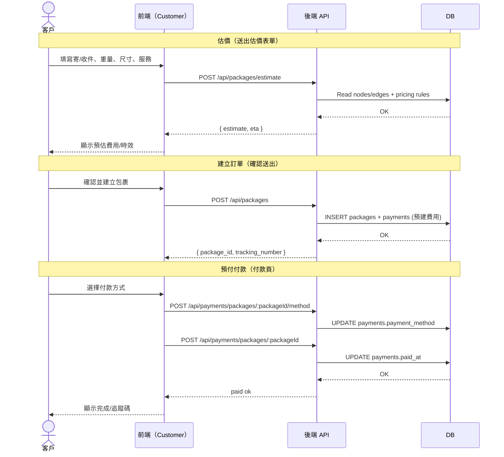
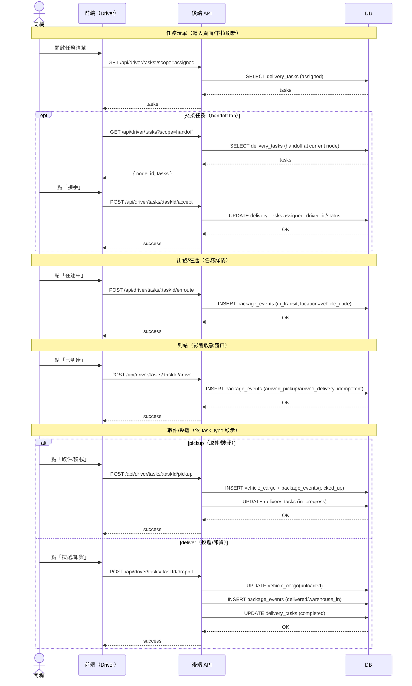
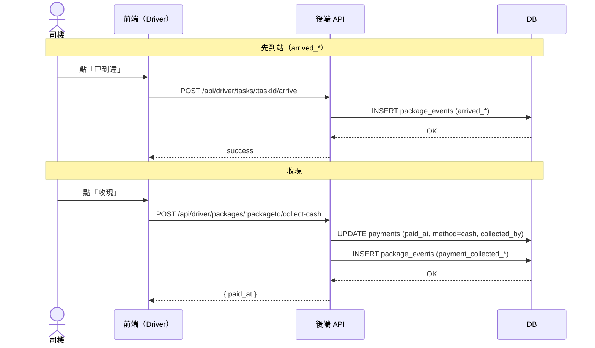
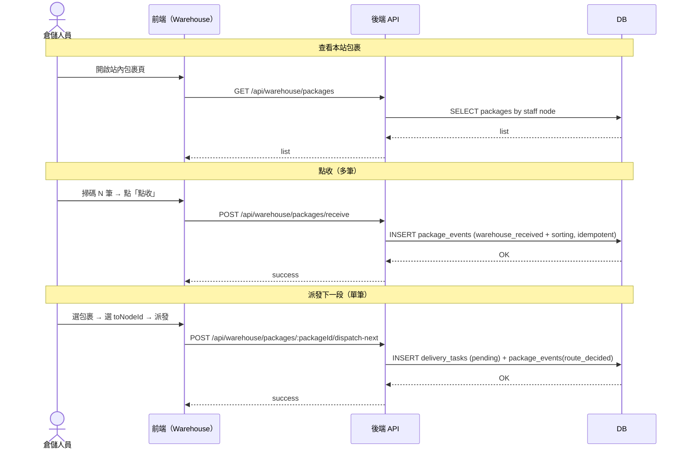
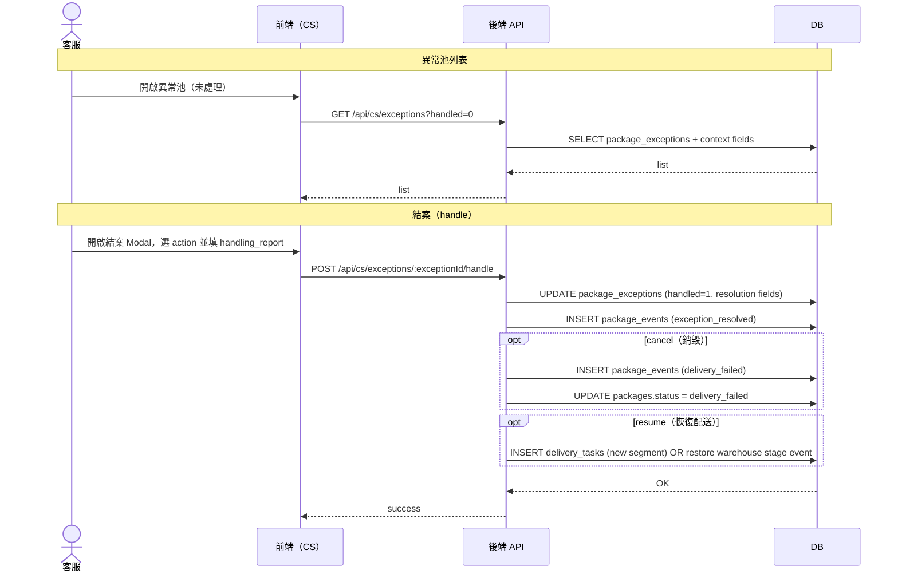
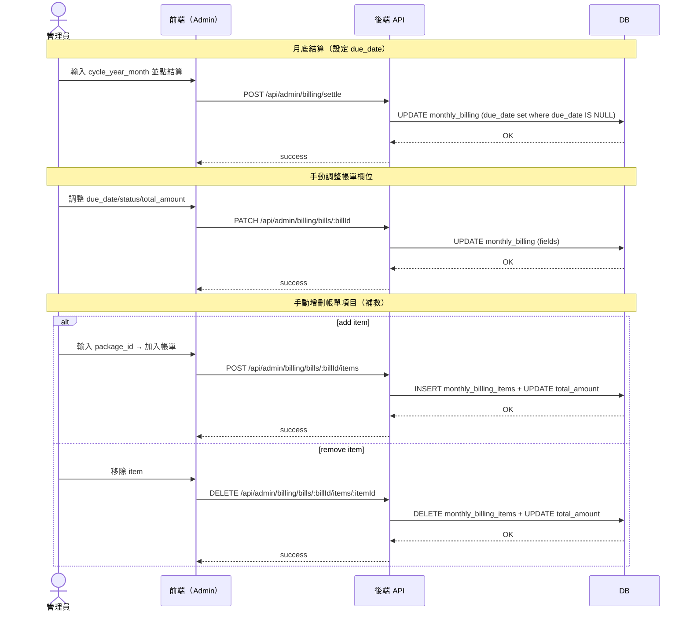

# 系統序列圖（Sequence Diagrams）

本文件以「前端 UI 觸發點」為主線，展示關鍵流程的互動時序；API 僅作為對照。

參考：

- UI 規範：`docs/design/ui-spec.md`
- 端到端功能：`docs/features/`
- API 參考：`docs/reference/api/`

---

## 1) Customer：寄件 + 預付付款（Prepaid）

UI 觸發點：

- `/customer/send`：先估價、再建立訂單
- `/customer/payment`：更新付款方式、再確認付款

---

## 2) Driver：任務清單 →（可選交接）→ 在途/到站 → 取件/投遞

UI 觸發點：

- 任務清單頁：`我的任務（assigned）`、`交接任務（handoff）`
- 任務詳情頁：`在途中`、`已到達`、`取件/裝載`、`投遞/卸貨`

---

## 3) Driver：到站收現（預付現金 / 到府代收）

UI 觸發點：

- 到站面板：到站後才顯示收現入口（並提示門檻）

---

## 4) Warehouse：點收/分揀 → 派發下一段

UI 觸發點：

- 站內包裹頁：掃碼點收（可多筆）→ 派發下一段（單筆）

---

## 5) CS：異常池 → 結案（Resume / Cancel）

UI 觸發點：

- 異常池列表：未處理/已處理
- 結案 Modal：選擇 resume/cancel，填寫處理報告

---

## 6) Admin：月底結算（settle）+ 帳單補救（手動調整/增刪項目）

UI 觸發點：

- 帳務作業頁：輸入 `YYYY-MM` → 結算
- 帳單維護頁：調整 due_date/狀態/金額、手動增刪 item（補單/移除）

