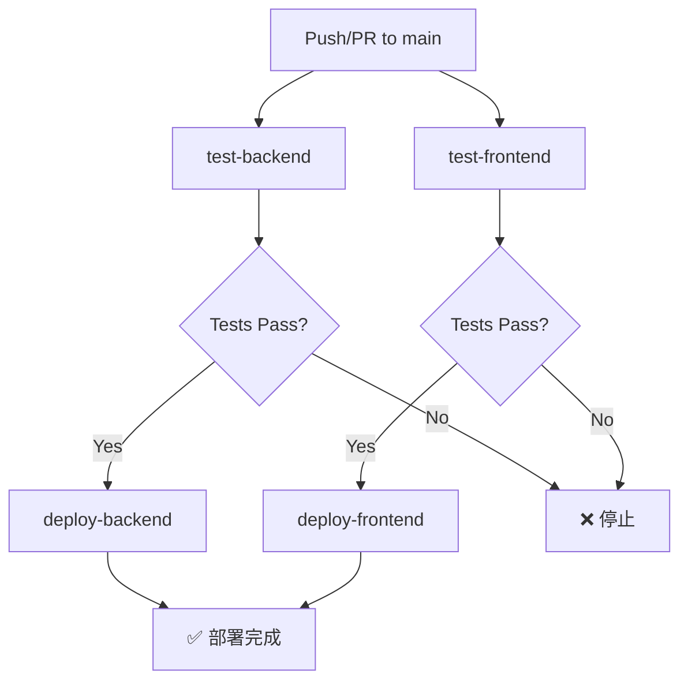

# CI/CD 設定指南 (CI/CD Setup Guide)

本文件說明如何設定 GitHub Actions 自動化測試與部署流程。

---

## 📋 概述 (Overview)

本專案使用 GitHub Actions 實現：
- ✅ **自動測試 (Automated Testing)**：每次 Push/PR 到 main 分支時執行
- 🚀 **自動部署 (Automated Deployment)**：測試通過後自動部署到 Cloudflare
  - 後端 → Cloudflare Workers
  - 前端 → Cloudflare Pages

---

## 🔄 工作流程說明 (Workflow Overview)

### 觸發條件 (Triggers)

```yaml
on:
  push:
    branches: [main]      # 推送到 main 分支
  pull_request:
    branches: [main]      # PR 到 main 分支
```

### Jobs 流程圖



### Jobs 說明

| Job | 說明 | 執行條件 |
|-----|------|----------|
| `test-backend` | 後端測試（Vitest） | 所有 Push/PR |
| `test-frontend` | 前端測試（Vitest） | 所有 Push/PR |
| `deploy-backend` | 部署後端到 Workers | Push to main + 測試通過 |
| `deploy-frontend` | 部署前端到 Pages | Push to main + 測試通過 |

> 💡 **重要**：PR 只會執行測試，不會觸發部署。

---

## 🔐 Cloudflare 設定步驟

### 步驟 1: 取得 Cloudflare API Token

1. 登入 [Cloudflare Dashboard](https://dash.cloudflare.com/)
2. 點擊右上角頭像 → **My Profile**
3. 左側選單選擇 **API Tokens**
4. 點擊 **Create Token**
5. 選擇 **Edit Cloudflare Workers** 範本
6. 設定權限：
   - **Account** → 選擇你的帳號 → **Cloudflare Workers:Edit**
   - **Zone** → 選擇你的網域（若有） → **Cloudflare Pages:Edit**
7. 點擊 **Continue to summary** → **Create Token**
8. **複製並保存這個 Token**（只會顯示一次）

### 步驟 2: 取得 Cloudflare Account ID

1. 在 [Cloudflare Dashboard](https://dash.cloudflare.com/)
2. 左側選單選擇 **Workers & Pages**
3. 右側會顯示 **Account ID**（類似 `32-字元的字串`）
4. 複製這個 Account ID

---

## 🔑 GitHub Secrets 設定

### 新增 Secrets 到 GitHub Repository

1. 前往你的 GitHub Repository
2. 點擊 **Settings**
3. 左側選單選擇 **Secrets and variables** → **Actions**
4. 點擊 **New repository secret**
5. 新增以下兩個 Secrets：

| Secret Name | 值 | 說明 |
|-------------|---|------|
| `CLOUDFLARE_API_TOKEN` | 步驟 1 取得的 Token | Cloudflare API Token |
| `CLOUDFLARE_ACCOUNT_ID` | 步驟 2 取得的 Account ID | Cloudflare Account ID |

### 設定步驟截圖參考

```
Settings → Secrets and variables → Actions → New repository secret
```

---

## 📦 Cloudflare Workers 設定（後端）

### wrangler.jsonc 設定

確認 `backend/wrangler.jsonc` 檔案包含正確設定：

```jsonc
{
  "name": "logistics-tracking-backend",
  "main": "src/index.ts",
  "compatibility_date": "2024-01-01",
  "node_compat": true,
  
  "d1_databases": [
    {
      "binding": "DB",
      "database_name": "logistics_db",
      "database_id": "YOUR_DATABASE_ID"  // 需要設定
    }
  ]
}
```

### 建立 D1 資料庫

```bash
# 建立 D1 資料庫
wrangler d1 create logistics_db

# 輸出會包含 database_id，複製到 wrangler.jsonc
```

### 套用 Migrations 到正式環境

```bash
cd backend
npx wrangler d1 migrations apply DB --remote
```

---

## 🌐 Cloudflare Pages 設定（前端）

### 方法 1: 使用 GitHub Actions（推薦）

已在 workflow 中設定，無需額外操作。

### 方法 2: 手動建立 Pages 專案

1. 前往 [Cloudflare Dashboard](https://dash.cloudflare.com/)
2. 左側選單選擇 **Workers & Pages**
3. 點擊 **Create application** → **Pages** → **Connect to Git**
4. 選擇你的 GitHub Repository
5. 設定：
   - **Project name**: `logistics-tracking-system`
   - **Production branch**: `main`
   - **Build command**: `npm run build`
   - **Build output directory**: `dist`
   - **Root directory**: `frontend`

---

## 🚀 首次部署

### 1. 確認 Secrets 已設定

```bash
# 檢查 GitHub Secrets（在 GitHub UI 檢視）
Settings → Secrets and variables → Actions
```

應該看到：
- ✅ CLOUDFLARE_API_TOKEN
- ✅ CLOUDFLARE_ACCOUNT_ID

### 2. 推送到 main 分支

```bash
git add .
git commit -m "chore: 新增 GitHub Actions CI/CD"
git push origin main
```

### 3. 檢視 Workflow 執行狀態

1. 前往 GitHub Repository
2. 點擊 **Actions** 頁籤
3. 觀察 **CI/CD** workflow 執行狀態

---

## 📊 Workflow 狀態監控

### GitHub Actions 頁面

```
https://github.com/bowen12274Bot/Logistics_tracking_system/actions
```

### Badge 狀態

在 README 加入 Badge：

```markdown

```

---

## 🔧 故障排除 (Troubleshooting)

### 常見問題

#### Q1: `CLOUDFLARE_API_TOKEN` 無效

**錯誤訊息：**
```
Error: Authentication error
```

**解決方法：**
1. 確認 Token 權限包含 **Workers:Edit** 和 **Pages:Edit**
2. 檢查 Token 是否已過期
3. 重新產生 Token 並更新 GitHub Secret

---

#### Q2: D1 資料庫找不到

**錯誤訊息：**
```
Error: Database not found
```

**解決方法：**
```bash
# 建立 D1 資料庫
wrangler d1 create logistics_db

# 更新 wrangler.jsonc 中的 database_id

# 套用 migrations
wrangler d1 migrations apply DB --remote
```

---

#### Q3: 前端部署失敗

**錯誤訊息：**
```
Error: Project not found
```

**解決方法：**
1. 前往 Cloudflare Dashboard 手動建立 Pages 專案
2. 確認 `projectName` 在 workflow 中正確設定
3. 確認 `CLOUDFLARE_ACCOUNT_ID` 正確

---

#### Q4: 測試失敗但本地測試通過

**可能原因：**
- GitHub Actions 使用乾淨環境
- 環境變數未設定

**解決方法：**
```bash
# 確保測試不依賴本地環境
npm ci  # 使用 clean install
npm test
```

---

## 📝 Workflow 檔案解析

### 後端測試 Job

```yaml
test-backend:
  runs-on: ubuntu-latest
  steps:
    - uses: actions/checkout@v4        # 下載程式碼
    - uses: actions/setup-node@v4      # 設定 Node.js
      with:
        node-version: '20'
        cache: 'npm'
    - run: npm ci                      # 安裝依賴
    - run: npm test                    # 執行測試
```

### 後端部署 Job

```yaml
deploy-backend:
  needs: test-backend                  # 依賴測試成功
  if: github.event_name == 'push'      # 僅 Push 觸發
  steps:
    - uses: actions/checkout@v4
    - run: npm ci
    - run: npx wrangler deploy          # 部署到 Workers
      env:
        CLOUDFLARE_API_TOKEN: ${{ secrets.CLOUDFLARE_API_TOKEN }}
```

---

## 🔄 更新 Workflow

### 修改 Workflow

編輯 `.github/workflows/ci-cd.yml`：

```bash
git add .github/workflows/ci-cd.yml
git commit -m "chore: 更新 CI/CD workflow"
git push origin main
```

### 停用 Workflow

1. 前往 GitHub Actions 頁面
2. 選擇 **CI/CD** workflow
3. 點擊右上角 **⋯** → **Disable workflow**

---

## 📚 相關文件 (Related Documentation)

- [GitHub Actions 官方文件](https://docs.github.com/en/actions)
- [Cloudflare Workers 部署](https://developers.cloudflare.com/workers/wrangler/ci-cd/)
- [Cloudflare Pages 部署](https://developers.cloudflare.com/pages/how-to/use-direct-upload-with-continuous-integration/)
- [專案 README](../README.md)
- [貢獻指南](contributing.md)（舊入口：`docs/contributing.md`）
