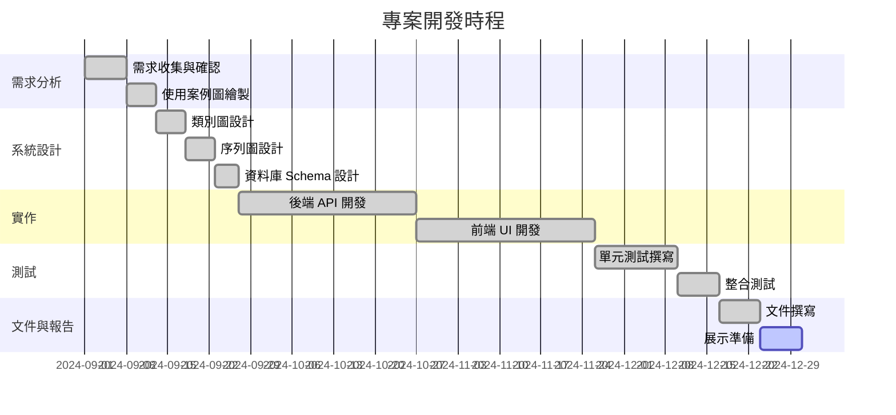

# 專案計畫書（Project Plan）

## 專案名稱
**包裹追蹤與計費系統 (Logistics Tracking System)**

## 專案目標
建立一套教學用物流模擬系統，讓多角色（客戶、司機、倉儲、客服、管理員）可於同一平台協作，透過虛擬地圖模擬包裹取件、轉運、配送與帳務流程。

## 團隊成員
| 角色 | 負責內容 |
|---|---|
| 全端開發 | 後端 API、前端介面、資料庫設計 |

## 開發時程 (Gantt)

## 風險管理

| 風險項目 | 影響程度 | 應對策略 |
|---|---|---|
| 需求變更 | 中 | 採用迭代開發，快速回應變更 |
| 技術困難 | 中 | 提早研究技術可行性，預留緩衝時間 |
| 時程延誤 | 高 | 設定里程碑，每週檢視進度 |
| 測試覆蓋不足 | 中 | 建立自動化測試，持續整合 |

## 品質管理

- **版本控制**：使用 Git 進行組態管理
- **自動化測試**：Vitest 單元測試框架
- **CI/CD**：GitHub Actions 自動執行測試與部署
- **程式碼審查**：所有變更經 Pull Request 審核

## 專題報告交付項目

- [x] 專案規劃（本文件）
- [x] 專案需求說明（使用案例）— `UML/TermProject114.md`
- [x] 系統模型（類別圖、序列圖）— `UML/*.puml`
- [x] 系統架構 — `docs/architecture/README.md`
- [x] 組態管理（Git）— GitHub Repository
- [x] 品質管理 — CI/CD 與測試覆蓋
- [x] 測試案例（單元測試）— `backend/src/__tests__/`
- [x] 展示說明（主要功能）— Demo 資料已準備
