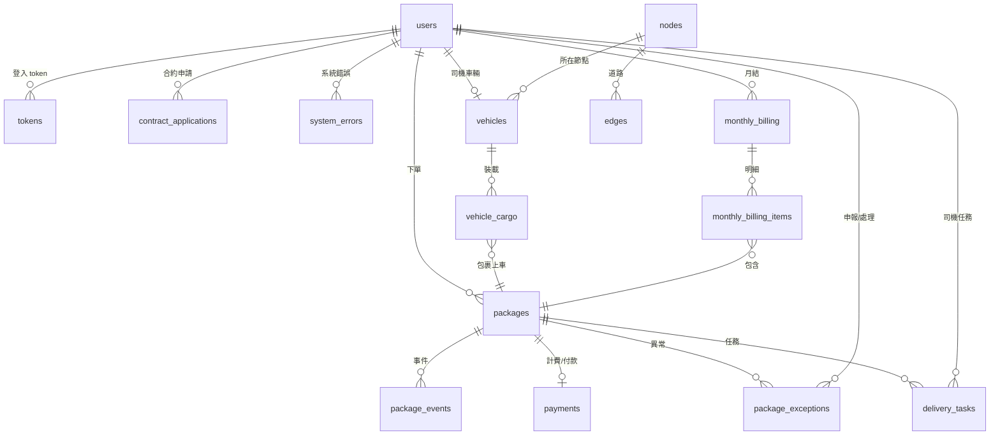

# 資料庫 Schema（D1 / SQLite）

本文件整理專案目前資料庫（Cloudflare D1 / SQLite 相容）的最終表結構；權威來源為 `backend/migrations/`。

## 目錄

- [1. 總覽](#1-總覽)
- [2. 表格定義](#2-表格定義)
- [3. ER 圖](#3-er-圖)
- [4. 索引清單](#4-索引清單)
- [5. 版本紀錄](#5-版本紀錄)

---

## 1. 總覽

| 表格名稱 | 說明 | Migration 檔案 |
|---|---|---|
| `users` | 使用者（客戶/員工） | `backend/migrations/0000_users.sql` |
| `packages` | 包裹主檔 | `backend/migrations/0001_packages.sql` |
| `package_events` | 包裹事件（append-only） | `backend/migrations/0002_package_events.sql` |
| `payments` | 付款/計費結果 | `backend/migrations/0003_payments.sql` |
| `monthly_billing` | 月結帳單主檔 | `backend/migrations/0004_monthly_billing.sql` |
| `monthly_billing_items` | 月結帳單明細（帳單包含哪些包裹） | `backend/migrations/0005_monthly_billing_items.sql` |
| `nodes` | 地圖節點（配送中心/站/終端） | `backend/migrations/0006_virtual_map_schema.sql`, `backend/migrations/0007_virtual_map_seed.sql` |
| `edges` | 地圖邊（道路/成本） | `backend/migrations/0006_virtual_map_schema.sql`, `backend/migrations/0007_virtual_map_seed.sql` |
| `contract_applications` | 合約客戶申請/審核 | `backend/migrations/0008_contract_applications.sql` |
| `tokens` | 認證 token | `backend/migrations/0009_tokens.sql` |
| `system_errors` | 系統錯誤/異常紀錄 | `backend/migrations/0010_system_errors.sql` |
| `package_exceptions` | 包裹異常（客服處理） | `backend/migrations/0012_package_exceptions.sql` |
| `delivery_tasks` | 運送任務（分段 pickup/deliver/transfer） | `backend/migrations/0013_delivery_tasks.sql` |
| `vehicles` | 車輛與位置 | `backend/migrations/0014_vehicles.sql` |
| `vehicle_cargo` | 車上貨物（包裹上車/下車記錄） | `backend/migrations/0015_vehicle_cargo.sql` |

### Seed / 測試資料 migrations

- `backend/migrations/0007_virtual_map_seed.sql`：建立/重建 `nodes`、`edges` 並寫入 seed
- `backend/migrations/0011_seed_test_users.sql`：寫入測試帳號/員工（依賴 `nodes` 已存在）

---

## 2. 表格定義

### 2.1 `users` - 使用者

```sql
CREATE TABLE IF NOT EXISTS users (
  id TEXT PRIMARY KEY,
  user_name TEXT NOT NULL,
  phone_number TEXT,
  address TEXT,
  email TEXT UNIQUE NOT NULL,
  password_hash TEXT NOT NULL,
  user_type TEXT NOT NULL CHECK (user_type IN ('customer', 'employee')),
  user_class TEXT NOT NULL,
  billing_preference TEXT,
  status TEXT DEFAULT 'active' CHECK (status IN ('active', 'suspended', 'deleted')),
  suspended_at TEXT,
  suspended_reason TEXT,
  deleted_at TEXT,
  created_at TEXT DEFAULT (strftime('%Y-%m-%dT%H:%M:%SZ', 'now'))
);
```

重點欄位：

- `user_type`：`customer` / `employee`
- `user_class`：客戶（`non_contract_customer` / `contract_customer`）；員工（`driver` / `warehouse_staff` / `customer_service` / `admin`）
- `address`：客戶端是預設地址；員工端是工作地（地圖節點 ID，例如 `HUB_0`、`REG_3`）

### 2.2 `packages` - 包裹主檔

```sql
CREATE TABLE IF NOT EXISTS packages (
  id TEXT PRIMARY KEY,
  customer_id TEXT,
  sender_name TEXT,
  sender_phone TEXT,
  sender_address TEXT,
  receiver_name TEXT,
  receiver_phone TEXT,
  receiver_address TEXT,
  weight INTEGER,
  size TEXT,
  delivery_time TEXT,
  payment_type TEXT,
  declared_value INTEGER,
  status TEXT DEFAULT 'created',
  estimated_delivery TEXT,
  final_billing_date TEXT,
  special_handling TEXT,
  tracking_number TEXT,
  contents_description TEXT,
  route_path TEXT,
  description_json TEXT,
  created_at TEXT DEFAULT (strftime('%Y-%m-%dT%H:%M:%SZ', 'now'))
);

CREATE INDEX IF NOT EXISTS idx_packages_status ON packages(status);
```

### 2.3 `package_events` - 包裹事件

```sql
CREATE TABLE IF NOT EXISTS package_events (
  id TEXT PRIMARY KEY,
  package_id TEXT,
  delivery_status TEXT,
  delivery_details TEXT,
  events_at TEXT,
  location TEXT
);

CREATE INDEX IF NOT EXISTS idx_package_events_package_id ON package_events(package_id);
CREATE INDEX IF NOT EXISTS idx_package_events_location ON package_events(location);
```

### 2.4 `payments` - 付款/計費結果

```sql
CREATE TABLE IF NOT EXISTS payments (
  id TEXT PRIMARY KEY,
  total_amount INTEGER,
  service_fee INTEGER,
  distance_fee INTEGER,
  weight_volume_fee INTEGER,
  special_fee INTEGER,
  calculated_at TEXT,
  paid_at TEXT,
  collected_by TEXT,
  package_id TEXT REFERENCES packages(id)
);

CREATE INDEX IF NOT EXISTS idx_payments_package_id ON payments(package_id);
```

### 2.5 `monthly_billing` - 月結帳單主檔

```sql
CREATE TABLE IF NOT EXISTS monthly_billing (
  id TEXT PRIMARY KEY,
  customer_id TEXT,
  cycle_start TEXT,
  cycle_end TEXT,
  next_generated_at TEXT,
  status TEXT DEFAULT 'pending' CHECK (status IN ('pending', 'paid', 'overdue')),
  total_amount INTEGER DEFAULT 0,
  due_date TEXT,
  paid_at TEXT,
  created_at TEXT DEFAULT (strftime('%Y-%m-%dT%H:%M:%SZ', 'now'))
);

CREATE INDEX IF NOT EXISTS idx_monthly_billing_customer_id ON monthly_billing(customer_id);
CREATE INDEX IF NOT EXISTS idx_monthly_billing_status ON monthly_billing(status);
```

### 2.6 `monthly_billing_items` - 月結帳單明細

```sql
CREATE TABLE IF NOT EXISTS monthly_billing_items (
  id TEXT PRIMARY KEY,
  monthly_billing_id TEXT,
  package_id TEXT
);

CREATE INDEX IF NOT EXISTS idx_monthly_billing_items_billing_id ON monthly_billing_items(monthly_billing_id);
```

### 2.7 `nodes` / `edges` - 地圖

> `0006_virtual_map_schema.sql` 建表；`0007_virtual_map_seed.sql` 會 `DROP TABLE` 後重建並寫入 seed。

```sql
CREATE TABLE nodes (
  id TEXT PRIMARY KEY,
  name TEXT,
  level INTEGER,
  subtype TEXT,
  x INTEGER,
  y INTEGER
);

CREATE TABLE edges (
  id INTEGER PRIMARY KEY AUTOINCREMENT,
  source TEXT,
  target TEXT,
  distance REAL,
  road_multiple INTEGER,
  cost INTEGER,
  FOREIGN KEY(source) REFERENCES nodes(id),
  FOREIGN KEY(target) REFERENCES nodes(id)
);

CREATE INDEX IF NOT EXISTS idx_edges_source ON edges(source);
```

### 2.8 `contract_applications` - 合約申請

```sql
CREATE TABLE IF NOT EXISTS contract_applications (
  id TEXT PRIMARY KEY,
  customer_id TEXT NOT NULL,
  company_name TEXT NOT NULL,
  tax_id TEXT NOT NULL,
  contact_person TEXT NOT NULL,
  contact_phone TEXT NOT NULL,
  billing_address TEXT NOT NULL,
  notes TEXT,
  status TEXT NOT NULL DEFAULT 'pending' CHECK (status IN ('pending', 'approved', 'rejected')),
  reviewed_by TEXT REFERENCES users(id),
  reviewed_at TEXT,
  review_notes TEXT,
  credit_limit INTEGER,
  created_at TEXT DEFAULT (strftime('%Y-%m-%dT%H:%M:%SZ', 'now'))
);

CREATE INDEX IF NOT EXISTS idx_contract_applications_customer ON contract_applications(customer_id);
CREATE INDEX IF NOT EXISTS idx_contract_applications_status ON contract_applications(status);
```

### 2.9 `tokens` - Token

```sql
CREATE TABLE IF NOT EXISTS tokens (
  id TEXT PRIMARY KEY,
  user_id TEXT NOT NULL REFERENCES users(id),
  created_at TEXT DEFAULT (strftime('%Y-%m-%dT%H:%M:%SZ', 'now')),
  expires_at TEXT
);

CREATE INDEX IF NOT EXISTS idx_tokens_user_id ON tokens(user_id);
```

### 2.10 `system_errors` - 系統錯誤

```sql
CREATE TABLE IF NOT EXISTS system_errors (
  id TEXT PRIMARY KEY,
  level TEXT NOT NULL CHECK (level IN ('info', 'warning', 'error', 'critical')),
  code TEXT,
  message TEXT NOT NULL,
  details TEXT,
  occurred_at TEXT DEFAULT (strftime('%Y-%m-%dT%H:%M:%SZ', 'now')),
  resolved INTEGER DEFAULT 0,
  resolved_by TEXT REFERENCES users(id),
  resolved_at TEXT
);

CREATE INDEX IF NOT EXISTS idx_system_errors_level ON system_errors(level);
CREATE INDEX IF NOT EXISTS idx_system_errors_resolved ON system_errors(resolved);
```

### 2.11 `package_exceptions` - 包裹異常

```sql
CREATE TABLE IF NOT EXISTS package_exceptions (
  id TEXT PRIMARY KEY,
  package_id TEXT NOT NULL REFERENCES packages(id),
  reported_by_user_id TEXT REFERENCES users(id),
  reason_code TEXT NOT NULL,
  description TEXT,
  location TEXT,
  reported_at TEXT,
  handled INTEGER NOT NULL DEFAULT 0,
  handled_at TEXT,
  handled_by_user_id TEXT REFERENCES users(id),
  action TEXT,
  handling_report TEXT
);

CREATE INDEX IF NOT EXISTS idx_package_exceptions_package_id ON package_exceptions(package_id);
CREATE INDEX IF NOT EXISTS idx_package_exceptions_handled_reported_at ON package_exceptions(handled, reported_at);
```

### 2.12 `delivery_tasks` - 運送任務

```sql
CREATE TABLE IF NOT EXISTS delivery_tasks (
  id TEXT PRIMARY KEY,
  package_id TEXT NOT NULL REFERENCES packages(id),
  task_type TEXT NOT NULL,
  from_location TEXT,
  to_location TEXT,
  assigned_driver_id TEXT REFERENCES users(id),
  status TEXT NOT NULL DEFAULT 'pending',
  segment_index INTEGER,
  instructions TEXT,
  created_at TEXT,
  updated_at TEXT
);

CREATE INDEX IF NOT EXISTS idx_delivery_tasks_assignee_status_created ON delivery_tasks(assigned_driver_id, status, created_at);
CREATE INDEX IF NOT EXISTS idx_delivery_tasks_package_segment ON delivery_tasks(package_id, segment_index);
```

### 2.13 `vehicles` - 車輛/位置

```sql
CREATE TABLE IF NOT EXISTS vehicles (
  id TEXT PRIMARY KEY,
  driver_user_id TEXT NOT NULL REFERENCES users(id),
  vehicle_code TEXT NOT NULL,
  home_node_id TEXT REFERENCES nodes(id),
  current_node_id TEXT REFERENCES nodes(id),
  updated_at TEXT
);

CREATE UNIQUE INDEX IF NOT EXISTS idx_vehicles_driver_user_id ON vehicles(driver_user_id);
```

### 2.14 `vehicle_cargo` - 車上貨物

```sql
CREATE TABLE IF NOT EXISTS vehicle_cargo (
  id TEXT PRIMARY KEY,
  vehicle_id TEXT NOT NULL REFERENCES vehicles(id),
  package_id TEXT NOT NULL REFERENCES packages(id),
  loaded_at TEXT,
  unloaded_at TEXT
);

CREATE INDEX IF NOT EXISTS idx_vehicle_cargo_vehicle_unloaded ON vehicle_cargo(vehicle_id, unloaded_at);
CREATE INDEX IF NOT EXISTS idx_vehicle_cargo_package_unloaded ON vehicle_cargo(package_id, unloaded_at);
CREATE UNIQUE INDEX IF NOT EXISTS uniq_vehicle_cargo_package_loaded ON vehicle_cargo(package_id) WHERE unloaded_at IS NULL;
```

重點約束：

- `uniq_vehicle_cargo_package_loaded` 確保同一個 `package_id` 同時間只會載在一台車上
- `unloaded_at IS NULL` 表示仍在車上；`unloaded_at` 有值代表已卸貨（保留歷史）

---

## 3. ER 圖



---

## 4. 索引清單

| 表格 | 索引 | 欄位 | 用途 |
|---|---|---|---|
| `packages` | `idx_packages_status` | `status` | 依狀態篩選包裹 |
| `edges` | `idx_edges_source` | `source` | 依起點查詢鄰居/路線 |
| `tokens` | `idx_tokens_user_id` | `user_id` | 依使用者查 token |
| `contract_applications` | `idx_contract_applications_customer` | `customer_id` | 依客戶查申請 |
| `contract_applications` | `idx_contract_applications_status` | `status` | 依狀態查申請 |
| `system_errors` | `idx_system_errors_level` | `level` | 依等級篩選 |
| `system_errors` | `idx_system_errors_resolved` | `resolved` | 依是否已處理篩選 |
| `package_exceptions` | `idx_package_exceptions_package_id` | `package_id` | 依包裹查異常 |
| `package_exceptions` | `idx_package_exceptions_handled_reported_at` | `handled, reported_at` | 查未處理/新進異常 |
| `delivery_tasks` | `idx_delivery_tasks_assignee_status_created` | `assigned_driver_id, status, created_at` | 司機工作清單 |
| `delivery_tasks` | `idx_delivery_tasks_package_segment` | `package_id, segment_index` | 依包裹查任務段落 |
| `vehicles` | `idx_vehicles_driver_user_id` | `driver_user_id` | 依司機取車輛 |
| `vehicle_cargo` | `idx_vehicle_cargo_vehicle_unloaded` | `vehicle_id, unloaded_at` | 依車輛查目前載貨/歷史 |
| `vehicle_cargo` | `idx_vehicle_cargo_package_unloaded` | `package_id, unloaded_at` | 依包裹查目前是否在車上 |
| `vehicle_cargo` | `uniq_vehicle_cargo_package_loaded` | `package_id` (WHERE `unloaded_at IS NULL`) | 保證包裹同時只在一台車上 |

---

## 5. 版本紀錄

| 版本 | 日期 | 說明 |
|---|---|---|
| 1.0 | 2025-12-24 | 同步到目前 migrations，補齊 `vehicles` / `vehicle_cargo` 文件 |

