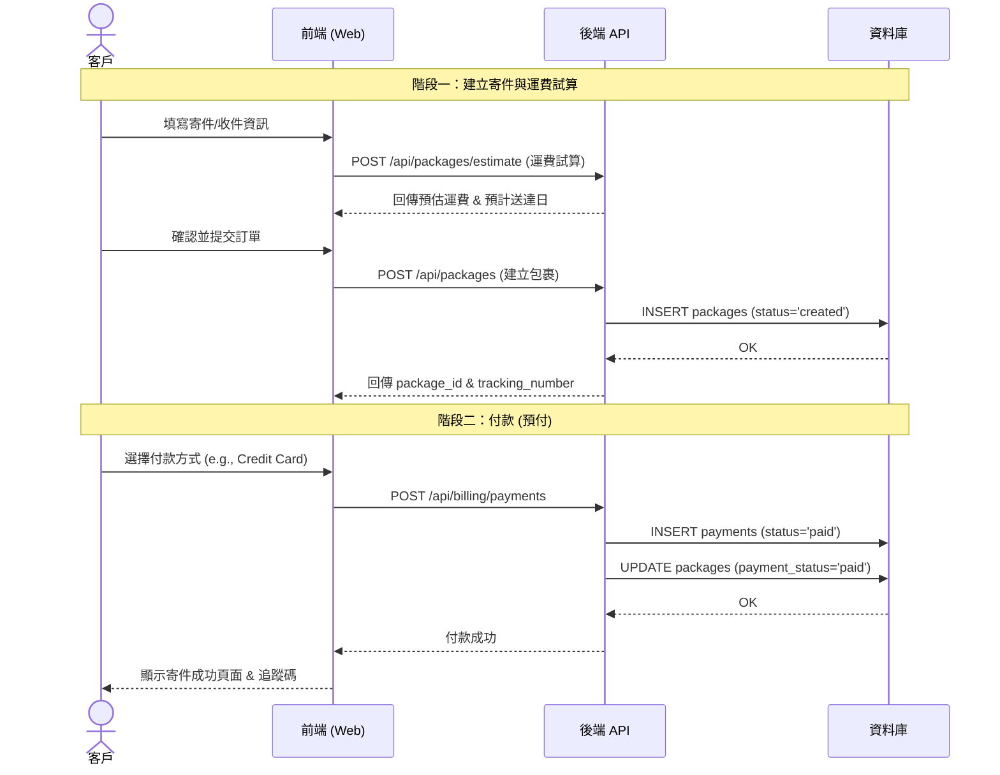
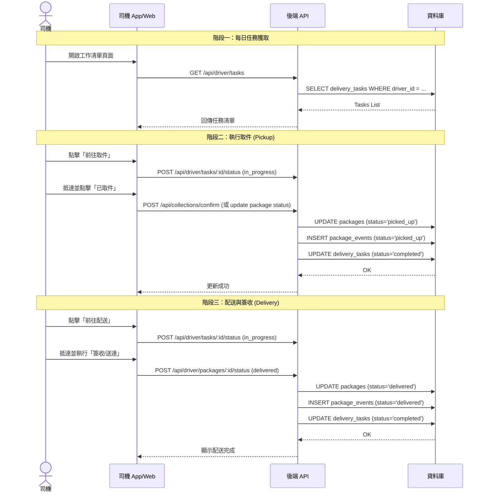
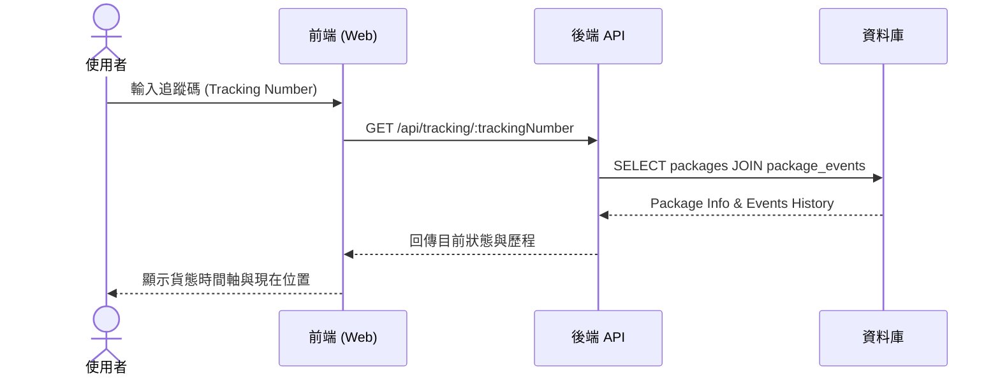
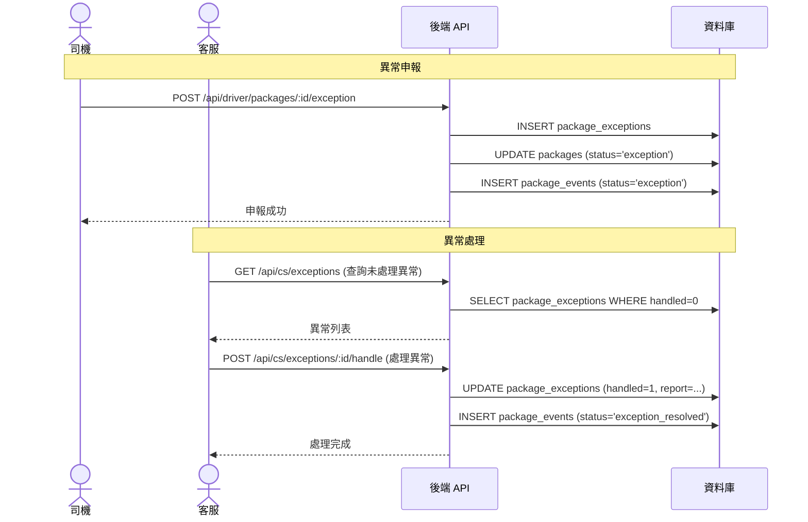

# 系統序列圖 (Sequence Diagrams)

本文件補足 `todoList.md` 中 P4 (序列圖) 的需求，展示系統關鍵流程的互動時序。

## 1. 寄件與付款流程 (Prepaid)

描述客戶建立寄件單、試算運費並完成付款的流程。

## 2. 司機取件與配送流程

描述司機接單、前往取件、配送並更新狀的流程。

## 3. 貨態查詢流程 (公開)

描述一般使用者透過追蹤碼查詢貨態。

## 4. 異常處理流程

描述配送異常的申報與客服處理流程。

